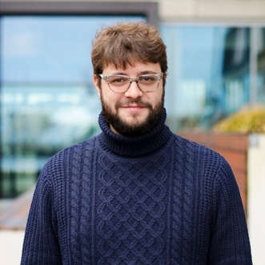

::: {layout="[25,60]" .profile-header}

:::::: {}

{.profile-pic}

::::::::: {.centerdiv}

[{width="15%"}](https://www.linkedin.com/in/riccardopinosio/)
[{width="15%" .light-hide}](https://www.github.com/riccardopinosio/)
[{width="15%" .dark-hide}](https://www.github.com/riccardopinosio/)
[{width="15%"}](https://scholar.google.com/scholar?hl=en&as_sdt=0%2C5&q=riccardo+pinosio&btnG=)

:::::::::

::::::

:::::: {}

I am director of R&D at [Knights Analytics](https://www.knightsanalytics.com). Before that I was a technologist at [Avanade](https://en.wikipedia.org/wiki/Avanade) and data scientist at [Funda](https://www.funda.nl/). I'm also on the scientific advisory board of [digi.bio](https://digi.bio).

I hold a PhD in logic from the [ILLC](https://www.illc.uva.nl) and lecture in machine learning at the [Amsterdam University of Applied Sciences](https://www.amsterdamuas.com/) and [CMI](https://www.cmihva.nl/en/).

I work at the intersection of research, business, and engineering because that's where product innovation happens. My current focus is on building large-scale distributed knowledge graphs (information extraction, entity resolution) and on graph machine learning, with applications primarily to AI assisted data management in banking, finance, healthcare, and life sciences.

::::::

:::

I also love open source, [emacs](https://www.gnu.org/software/emacs/), and weird programming languages that provide new perspectives on computation. I am the author of [hugot](https://github.com/knights-analytics/hugot), an open source LLM inference runtime for Go, and of [ortgenai](https://github.com/knights-analytics/ortgenai), Go bindings to the onnxruntime-genai C API. I also contribute to [onnxruntime_go](https://github.com/yalue/onnxruntime_go), [onnx-gomlx](https://github.com/gomlx/onnx-gomlx), and other projects working to expand the machine learning ecosystem in golang.

My biggest hobby is literature, and my father is an [italian teacher, painter and writer](https://www.corradopinosio.com).

## [{width="6%"}]() Contacts

The best way to get in contact with me is to email me at contact@riccardopinosio.com, or to shoot me a DM on [linkedin](https://www.linkedin.com/in/riccardopinosio).

---

## [{width="6%"}]() Blog

::: {#blog-listings}
:::

## [{width="6%"}]() Colophon

This website is written in emacs {width=2%} and generated with [Quarto](https://quarto.org/), adapting a theme from [Hamel Husain](https://hamel.dev/).
